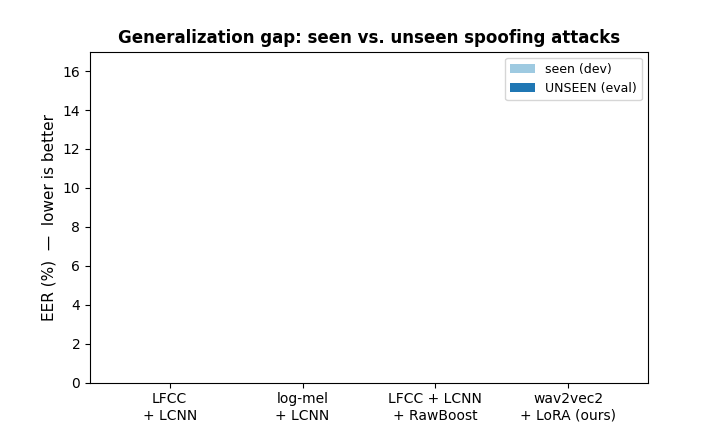
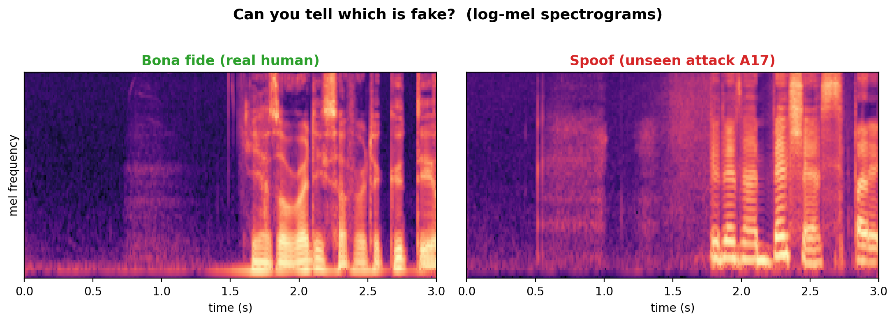
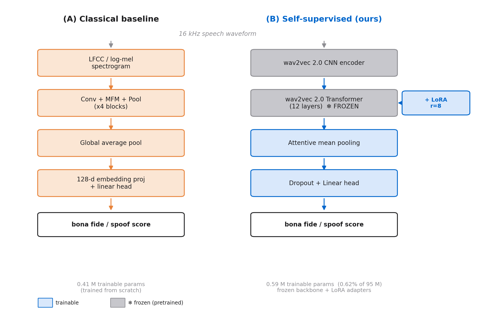
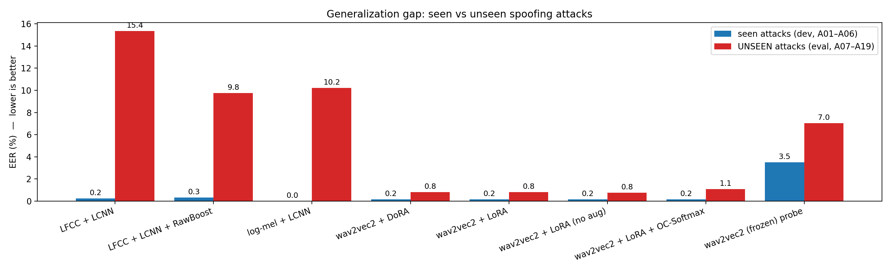
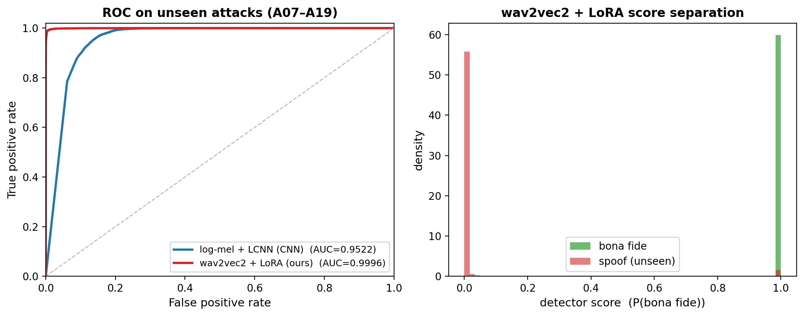

# Fake It Till You Make It
### Generalizable Detection of AI-Generated Speech (Audio Anti-Spoofing)

PyTorch project for **00460217 – Deep Learning** (Technion). We detect whether a speech clip is
**bona fide** (real) or **spoof** (TTS / voice-conversion), and we focus on the question that
matters for real deployment: **how well does a detector generalize to spoofing attacks it has
never seen during training?**

Based on / inspired by:

Müller et al., [*Does Audio Deepfake Detection Generalize?*](https://arxiv.org/abs/2203.16263), Interspeech 2022
Wang et al., [*ASVspoof 2019: A large-scale public database ...*](https://www.asvspoof.org/), 2019
Tak et al., [*wav2vec 2.0 + RawBoost for anti-spoofing*](https://arxiv.org/abs/2202.12233), ICASSP 2022



> **Headline result:** adapting a frozen wav2vec 2.0 with LoRA (<1 % of its parameters)
> cuts the seen→unseen EER gap from **9–15 pp** (classical CNN family) to **0.64 pp** —
> a **~15–16× reduction** against the log-mel and RawBoost CNN baselines (23.6× against our
> LFCC baseline, a ratio we flag as provisional — see [Results](#results)).

- [Fake It Till You Make It](#fake-it-till-you-make-it)
  * [Background](#background)
  * [The Question](#the-question)
  * [Method](#method)
  * [Results](#results)
    + [Reproducing these numbers](#reproducing-these-numbers)
  * [Prerequisites](#prerequisites)
  * [Files in the repository](#files-in-the-repository)
  * [Dataset](#dataset)
  * [Usage](#usage)
    + [1. Setup](#1-setup)
    + [2. Train a model](#2-train-a-model)
    + [3. Evaluate (seen vs. unseen)](#3-evaluate-seen-vs-unseen)
    + [4. Reproduce all experiments](#4-reproduce-all-experiments)
  * [Run on Google Colab](#run-on-google-colab)
  * [Conclusion & Future Work](#conclusion--future-work)
  * [Ethics Statement](#ethics-statement)
  * [References](#references)

## Background

Modern text-to-speech and voice-conversion systems produce speech that humans can no longer
reliably tell apart from real recordings. This enables voice-cloning fraud, audio
misinformation, and attacks on voice-biometric authentication. **Anti-spoofing** (a.k.a. audio
deepfake detection) is the countermeasure: a classifier that flags synthetic speech.

The hard part is **generalization**. A detector trained on a handful of known generators usually
overfits their artifacts and fails on a *new* generator it has never seen — exactly the situation
in the real world, where attackers always use the newest model. We measure this gap directly and
test whether a **self-supervised speech representation (wav2vec 2.0)** adapted with **LoRA**
closes it relative to a classic **spectrogram-CNN** baseline.


_A real clip and a high-quality synthetic clip (from an unseen attack) look nearly identical as
spectrograms — which is exactly why a detector that memorizes known artifacts breaks on new ones._

### Related work
We build on published anti-spoofing research rather than a prior course project: the **ASVspoof
2019** benchmark and protocol (Wang et al.), the **generalization-gap** study of Müller et al.
(2022), **wav2vec 2.0** self-supervised speech (Baevski et al.), **LoRA/DoRA** parameter-efficient
fine-tuning (Hu et al.; Liu et al.), **RawBoost** augmentation (Tak et al.), and **OC-Softmax**
one-class loss (Zhang et al.). Our contribution is a controlled, matched comparison of the
seen→unseen gap across a classical CNN and a LoRA-adapted SSL model, with PEFT / augmentation /
loss ablations and a per-attack breakdown. Full citations in the [References](#references) below
and in the submitted report.

## The Question

> Train only on spoofing attacks `A01–A06`. Test on **unseen** attacks `A07–A19`.
> How large is the seen→unseen performance gap, and which model survives it?

The ASVspoof 2019 LA protocol is purpose-built for this: the evaluation set contains 13 attack
algorithms that never appear in training. No manual splitting required.

## Method

We compare two detector families on identical data, splits, and metrics.



- **(A) Classical baseline.** An LFCC or log-mel spectrogram feeds a Light CNN (LCNN) with
  Max-Feature-Map activations — the pre-SSL generation of anti-spoofing systems, trained from
  scratch (0.41 M parameters).
- **(B) Ours.** A **frozen** wav2vec 2.0 backbone (95 M parameters, self-supervised pretraining)
  is adapted with **LoRA** — low-rank residual updates injected into the attention projections —
  followed by attentive pooling and a linear head. Only **0.59 M** parameters (0.62 %) are trained.

## Results

EER %, lower is better. Trained on seen attacks A01–A06, evaluated on **unseen**
A07–A19. The **gap** (unseen − seen) is the headline: a smaller gap means the
detector generalizes to attacks it never saw. These are the measured values from our
runs; this repository ships the code that produces them, not the run artifacts
themselves (see [Reproducing these numbers](#reproducing-these-numbers)).

| Model                                  | Trainable params | Dev EER (seen) | Eval EER (unseen) | Gap (pp) | min t-DCF |
|----------------------------------------|------------------|----------------|-------------------|----------|-----------|
| LFCC + LCNN (baseline)                 | 0.41 M           | 0.23           | 15.36             | 15.13    | 0.356 |
| log-mel + LCNN                         | 0.41 M           | 0.00           | 10.22             | 10.22    | 0.219 |
| LFCC + LCNN + RawBoost                 | 0.41 M           | 0.31           | 9.76              | 9.45     | 0.227 |
| wav2vec2 (frozen) + linear probe       | 0.002 M          | 3.49           | 7.04              | 3.55     | 0.191 |
| wav2vec2 + LoRA + OC-Softmax           | 0.59 M           | 0.16           | 1.09              | 0.93     | 0.029 |
| wav2vec2 + LoRA, no augmentation       | 0.59 M           | 0.16           | 0.76              | 0.60     | 0.024 |
| wav2vec2 + DoRA                        | 0.63 M           | 0.16           | 0.80              | 0.64     | 0.024 |
| **wav2vec2 + LoRA (ours)**             | **0.59 M**       | **0.16**       | **0.80**          | **0.64** | **0.026** |



On the **unseen** eval set, wav2vec2 + LoRA is near-perfect (AUC 0.9996) while the log-mel + LCNN
baseline trails (AUC 0.952; the LFCC + LCNN baseline is lower still at 0.922). Its scores separate
cleanly into bona fide vs. spoof even on attacks it never trained on:



**Takeaways.**
- The classic spectrogram-CNN **collapses on unseen attacks** (9–15 pp gap); wav2vec2 + LoRA
  — adapting <1 % of a frozen self-supervised model — cuts the gap to **0.64 pp**: **~15–16×
  smaller** than the log-mel (16.0×) and RawBoost (14.8×) CNN baselines, and 23.6× smaller than
  the LFCC baseline — a ratio we treat as provisional, see
  [Reproducing these numbers](#reproducing-these-numbers).
  min t-DCF is ~14× better than that same LFCC baseline (0.026 vs 0.356).
- **Adaptation, not just pretrained features, is what matters:** a frozen wav2vec2 with only a
  linear probe (0.002 M params) still sits at 7.04 % unseen EER — LoRA is ~9× better.
- **DoRA ≈ LoRA** here (both 0.64 pp) — DoRA's weight decomposition gives no gain on this task.
- **RawBoost** narrows the CNN gap (15.13 → 9.45 pp) but does not close it; for wav2vec2 it makes
  no difference (0.60 vs 0.64 pp) — the SSL representation is already invariant to it.
- **OC-Softmax** slightly *increases* the wav2vec2 gap (0.64 → 0.93 pp) — an honest negative result.
- Per-attack, the CNN fails hardest on A12/A13/A17/A18 (25–30 % EER) while wav2vec2 + LoRA
  never exceeds 2.7 % on any attack (worst case A18 at 2.61 %) (see `results/figures/per_attack.png`).

### Reproducing these numbers

This repository is code-only: run artifacts (`runs/`) and the report are kept out of it
deliberately, so the table above cannot be recomputed from anything checked in here — it has to be
re-earned by running the experiments. `scripts/run_all.py` regenerates `runs/*/`, then
`scripts/collate_results.py` rebuilds the table and `scripts/make_figures.py` the figures. Budget
~20 min on a small GPU for an LCNN baseline and 3–5 h on an L4 for the wav2vec2 runs; every run
is seeded (1234) and its config is committed under `configs/`.

Two honest caveats travel with the table, and they hold regardless of what is or isn't published:

- Our runs stored model, optimizer, scheduler and scaler state but **not** RNG state, and we did
  not enable cuDNN-deterministic kernels (`deterministic: true` is available in the config), so a
  re-run reproduces the results statistically, not bit-for-bit.
- The **LFCC + LCNN** row's raw scores were lost to an accidental cleanup after the run finished;
  its values are real measurements recorded from the completed run, but we could not re-derive them
  afterwards. Since that row anchors the largest ratio we quote, **23.6× is provisional** — the
  **~15–16×** headline rests on the log-mel and RawBoost baselines instead.

Checkpoints were never published either way: the SSL ones store the frozen 95 M-parameter
backbone. min t-DCF additionally needs the organizer ASV score file that ships with the corpus.

## Prerequisites

| Library        | Version (tested) |
|----------------|------------------|
| `Python`       | `3.10`           |
| `torch` / `torchaudio` | `2.5.1` (CUDA 12.1) |
| `transformers` | `4.49` (`>=4.46,<4.50`) |
| `peft`         | `0.15.2` (LoRA/DoRA; `>=0.13,<0.16`) |
| `scipy`        | `1.10+` (RawBoost) |
| `soundfile`    | `0.12+` (FLAC on Windows) |
| `scikit-learn` / `numpy` / `matplotlib` / `pyyaml` / `tqdm` / `pytest` | latest |

Install with `pip install -r requirements.txt` (Colab), or locally with conda:
`conda env create -f environment.yml && conda activate dlproj`.

## Files in the repository

| File / Folder                 | Purpose |
|-------------------------------|---------|
| `src/data.py`                 | ASVspoof 2019 LA protocol parser, dataset (train=random crop, eval=center crop), loaders, `--verify` |
| `src/features.py`             | Front-ends: LFCC, log-mel, wav2vec2 (frozen, input-normalized) |
| `src/augment.py`              | RawBoost port (convolutive + impulsive, Tak et al., credited) |
| `src/models.py`               | Model zoo: LCNN (MFM), wav2vec2 + LoRA/DoRA/linear-probe classifier |
| `src/losses.py`               | Weighted BCE and OC-Softmax (both wired into training + scoring) |
| `src/metrics.py`              | EER, official min t-DCF, ROC-AUC (vectorized DET sweep) |
| `src/train.py`                | Config-driven loop: AMP, cosine LR (held flat for epoch 1), early stopping on dev EER, resume, CSV logs |
| `src/eval.py`                 | Seen-vs-unseen EER, per-attack breakdown, t-SNE export, scores.npz dumps |
| `src/utils.py`                | Seeding (incl. dataloader workers), config load, metrics.json helpers |
| `configs/*.yaml`              | One config per experiment (8 experiments: baselines, LoRA, ablations) |
| `scripts/download_data.py`    | Kaggle-mirror download via `kagglehub` (cached/resumable) + extraction + layout + verification |
| `scripts/make_subset.py`      | Balanced fast-iteration subset protocols |
| `scripts/run_all.py`          | Runs every experiment in priority order, skip/resume-safe |
| `scripts/collate_results.py`  | `runs/*/metrics.json` → `results/RESULTS.md` (the Results table above) |
| `scripts/make_figures.py`     | Gap, per-attack, efficiency and training-curve figures from saved run artifacts |
| `scripts/make_roc_fig.py`     | ROC + score-separation figure, recomputed from a run's `scores_*.npz` |
| `scripts/make_arch_diagram.py` / `make_spectrogram_fig.py` / `make_gap_animation.py` | The remaining report/README figures |
| `results/figures/`            | Generated figures used in this README |
| `tests/`                      | Unit tests for metrics, protocol parsing, and models |
| `notebooks/colab_quickstart.ipynb` | End-to-end Colab notebook (download → verify → train → eval → figures) |

## Dataset

ASVspoof 2019 LA (Open Data Commons license). We download it from the **Kaggle
mirror** [`awsaf49/asvpoof-2019-dataset`](https://www.kaggle.com/datasets/awsaf49/asvpoof-2019-dataset),
which hosts the full official LA tree (flac + cm protocols + the ASV score files
needed for min t-DCF). The original Edinburgh DataShare server
([handle 10283/3336](https://datashare.ed.ac.uk/handle/10283/3336)) refuses
programmatic downloads, so Kaggle is the reliable path both on Colab and locally.

**One-time Kaggle setup** (free, required — the download will not work without it):
you need a Kaggle account, then kaggle.com → Settings → API → *Create New Token*.
That gives you a bearer token starting `KGAT_`; save the token text (nothing else) to
`~/.kaggle/access_token` (Windows: `C:\Users\<you>\.kaggle\access_token`).
`kagglehub` picks it up automatically; no other config needed. On Colab the notebook
prompts you for the token and writes that file for you.

```bash
# Download (~23.6 GB, needs ~50 GB free) + extract + verify. Keep data OUTSIDE OneDrive:
python scripts/download_data.py --out C:\asvspoof     # local
python scripts/download_data.py --out ./data          # Colab (token pasted in the notebook)

# Re-verify an existing installation at any time:
python -m src.data --root C:\asvspoof --verify
```

The protocol files label each utterance with its attack id (`A01–A19`); `src/data.py`
parses them so the seen/unseen split comes for free. If your data lives outside the
repo, pass `--data-root C:\asvspoof` to the train/eval commands below.

## Usage

### 1. Setup
```bash
pip install -r requirements.txt
python scripts/download_data.py --out ./data
python -m pytest tests -q            # sanity-check metrics/parser/models first
```

### 2. Train a model
```bash
# Optional fast sanity run on a balanced subset (~20 min on a T4):
python scripts/make_subset.py --root ./data
python -m src.train --config configs/baseline_lcnn_lfcc.yaml --subset

# Spectrogram-CNN baseline (full)
python -m src.train --config configs/baseline_lcnn_lfcc.yaml

# Our proposed wav2vec2 + LoRA detector (resumable after Colab disconnects: --resume)
python -m src.train --config configs/wav2vec2_lora.yaml --resume
```

### 3. Evaluate (seen vs. unseen)
```bash
python -m src.eval --config configs/wav2vec2_lora.yaml \
                   --ckpt runs/wav2vec2_lora/best.pt \
                   --report per_attack --tsne
```
This prints Dev (seen) EER, Eval (unseen) EER, the generalization gap, min t-DCF, a
per-attack EER table, and saves the raw scores (`scores_*.npz`), `metrics.json`, and a
t-SNE of the embeddings (`tsne_eval.png`) into the run directory.

### 4. Reproduce all experiments
```bash
python scripts/run_all.py            # every config in priority order; skip/resume-safe
python scripts/collate_results.py    # -> results/RESULTS.md (the table above)
python scripts/make_figures.py       # -> results/figures/*.png
```

## Run on Google Colab

`notebooks/colab_quickstart.ipynb` runs the whole pipeline end-to-end (download → verify →
train → eval → figures). **Before you start, get a Kaggle API token** — the dataset comes from
a Kaggle mirror and cannot be downloaded without one (see [Dataset](#dataset)): kaggle.com →
Settings → API → *Create New Token*, and copy the `KGAT_...` token it gives you.

1. Open the notebook in Colab and set **Runtime → Change runtime type → GPU** (T4 to start,
   L4 for the full runs).
2. Run the cells in order. The clone/install cell sets up the repo; the next cell mounts Google
   Drive and points `runs/` at it, so finished experiments survive a VM reset — re-running the
   training cell auto-skips anything already complete.
3. The **Kaggle credentials** cell prompts you to paste your `KGAT_` token; it writes it to
   `~/.kaggle/access_token` on the VM. This is per session, since Colab wipes the VM disk.
4. The download cell fetches ASVspoof 2019 LA (~23.6 GB, ≈20–30 min), then the remaining cells
   run the tests, an optional ~20 min subset sanity run, and the full wav2vec2 experiments
   (≈3–5 h; resumable — just rerun the cell if the session drops).

Results and figures are mirrored to `Drive/MyDrive/dlproj/`, so a session reset never loses
progress.

## Conclusion & Future Work

Adapting a **frozen self-supervised speech model with LoRA** reduces the seen→unseen generalization
gap from **9–15 pp** (classical spectrogram-CNN family) to **0.64 pp**, while training under **1 %**
of the backbone's parameters. Our ablations show the improvement comes from the *combination* of a
strong pretrained representation **and** an expressive adaptation mechanism — LoRA and DoRA both far
outperform a linear probe on the same frozen backbone, so pretrained features alone are not enough.
RawBoost augmentation and the OC-Softmax loss, both designed to aid generalization, gave no benefit
on top of the SSL representation (honest negative results).

Two caveats travel with that headline. The CNN-vs-SSL contrast compares two system *families*
(front-end, back-end and pooling all differ), so the clean single-factor evidence is the
probe-vs-LoRA ablation; and the largest ratio we quote rests on the LFCC baseline whose raw
artifacts were lost, making **~15–16×** — not 24× — the figure our evidence fully supports
(see [Reproducing these numbers](#reproducing-these-numbers)).

**Future work:** re-running that LFCC baseline with its artifacts preserved (the first thing we
would do with more time — not a new model); a zero-shot test on the independently recorded
*In-the-Wild* corpus (a harder, cross-condition generalization test); a full-fine-tuning reference
point to price the frozen-prior decision we argued for but did not test; scaling to a larger
backbone (XLS-R); and multi-seed error bars on the headline comparison.

## Ethics Statement

The full ethics statement — stakeholders, implications, and the considerations around privacy,
fraud, consent, dual-use, and fairness — is part of the submitted report, kept separate from this
code repository.

## References

[1] X. Wang et al., "ASVspoof 2019: A large-scale public database of synthesized, converted and replayed speech," *Computer Speech & Language*, 2020.
[2] N. Müller et al., "Does Audio Deepfake Detection Generalize?," *Interspeech*, 2022.
[3] H. Tak et al., "Automatic speaker verification spoofing and deepfake detection using wav2vec 2.0 and data augmentation," *Odyssey / ICASSP*, 2022.
[4] J. Jung et al., "AASIST: Audio Anti-Spoofing using Integrated Spectro-Temporal Graph Attention Networks," *ICASSP*, 2022.
[5] A. Baevski et al., "wav2vec 2.0: A Framework for Self-Supervised Learning of Speech Representations," *NeurIPS*, 2020.
[6] E. Hu et al., "LoRA: Low-Rank Adaptation of Large Language Models," *ICLR*, 2022.
[7] S. Liu et al., "DoRA: Weight-Decomposed Low-Rank Adaptation," *ICML*, 2024.
